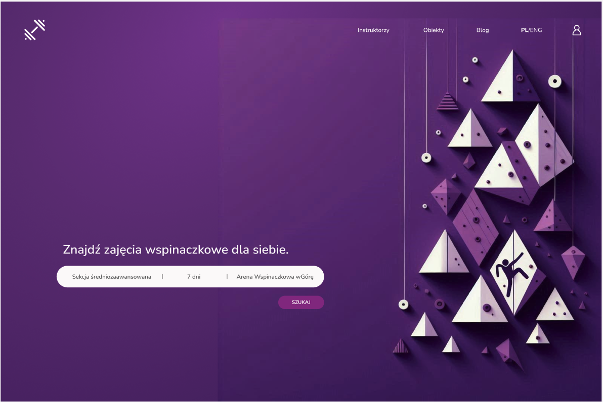

# ZNAJDZINSTRUKTORA

## Project Description
ZNAJDZINSTRUKTORA is an online portal that facilitates booking sports lessons with an instructor. The project aims to simplify the process of finding and booking sports classes in various disciplines.

## Features
- Registration and login for instructors
- Instructor profile with photo upload
- Instructor profile with information about classes and available spots
- Searching for instructors by city, sport discipline, and availability
- Displaying the instructor's schedule

## Technologies
- **Frontend:** React
- **Backend:** Node.js
- **Database:** MongoDB

## Usage
- Search for available instructors and check their schedule.
- Register as an instructor.
- Add information to your profile.

## Contributors
- github: [Zuzanna Maciejczyk](https://www.github.com/Zjadlbyscos)
- github: [Rafał Cegliński](https://www.github.com/RafalCeglinsk)

## Contact
Email: halo.instruktorzy@gmail.com

